# 📊 Diagramas UML do Sistema

## Visão Geral do Sistema

## 🔹 Diagrama de Caso de uso
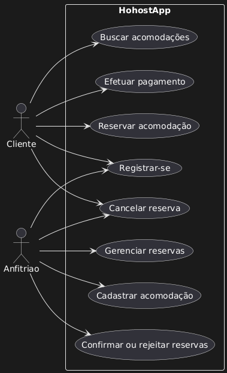

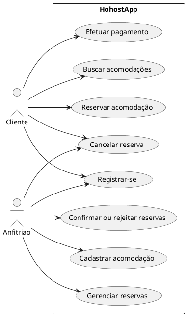

## 🔹 Diagramas de Atividades

### Registrar-se (Cliente / Anfitrião):
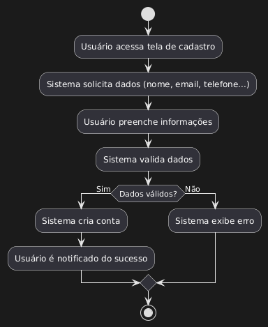

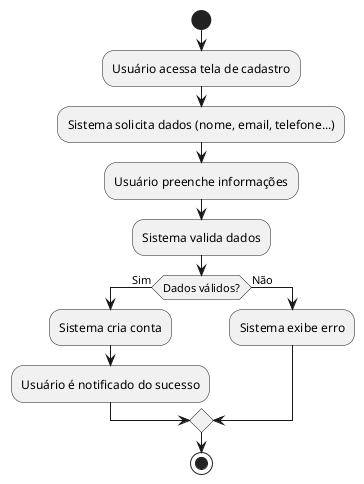
### Buscar acomodações:
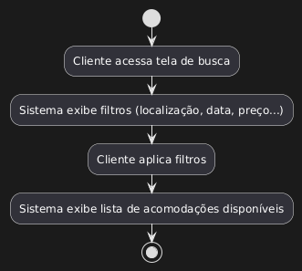

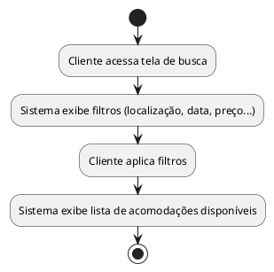
### Reservar acomodação:
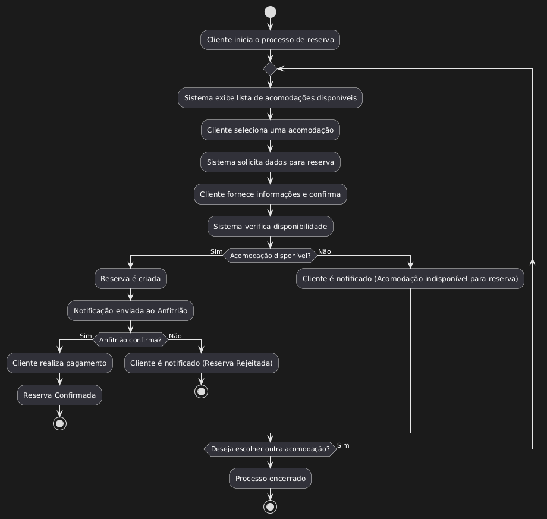

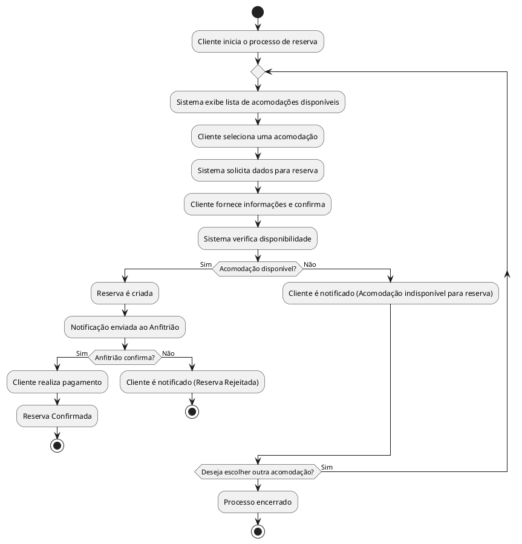
### Efetuar pagamento:
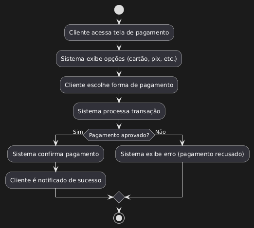

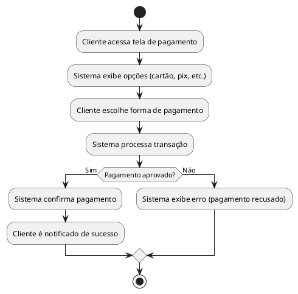
### Cancelar reserva:
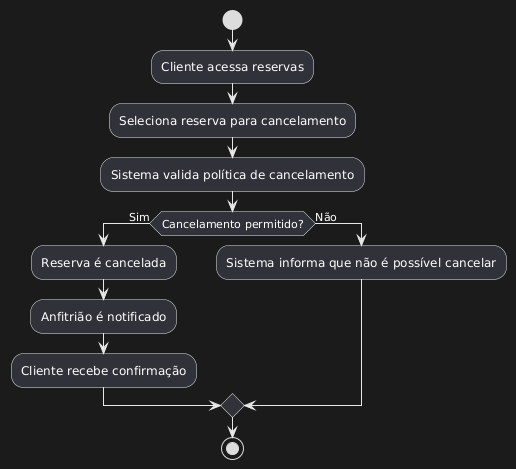

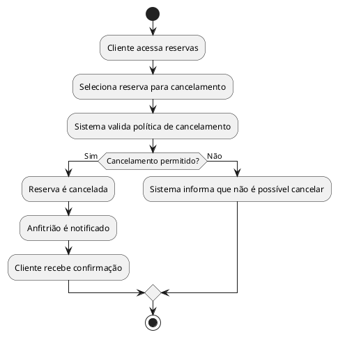
### Cadastrar acomodação:
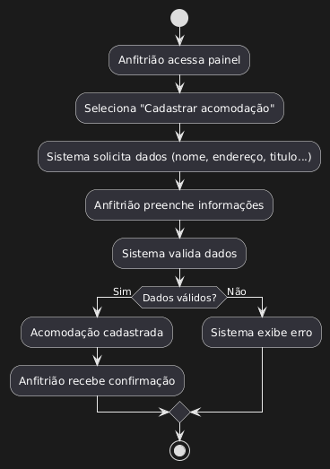

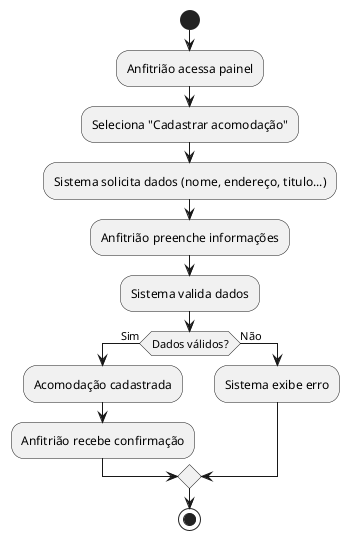
### Gerenciar reservas:
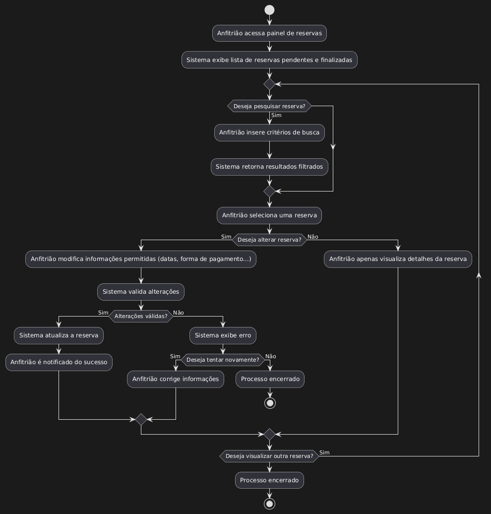

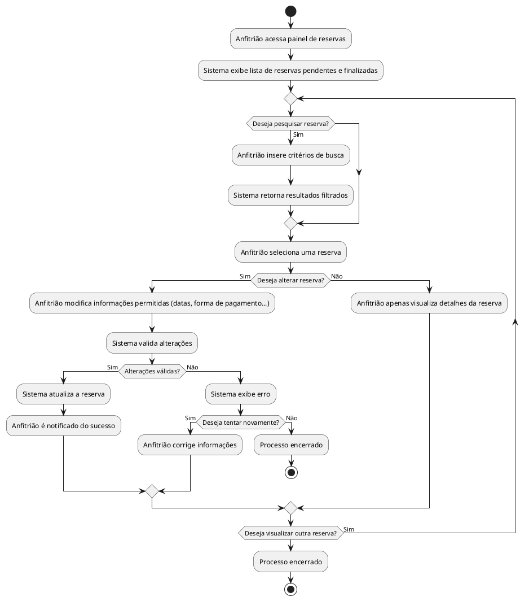
### Confirmar ou rejeitar reservas:
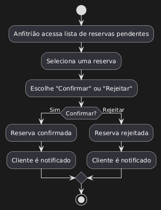

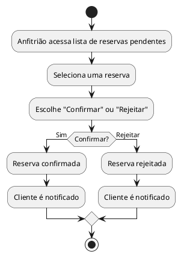
## 🔹 Diagrama de Classes
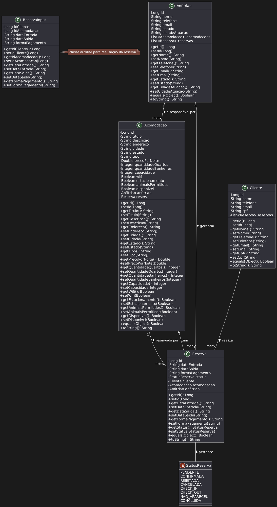

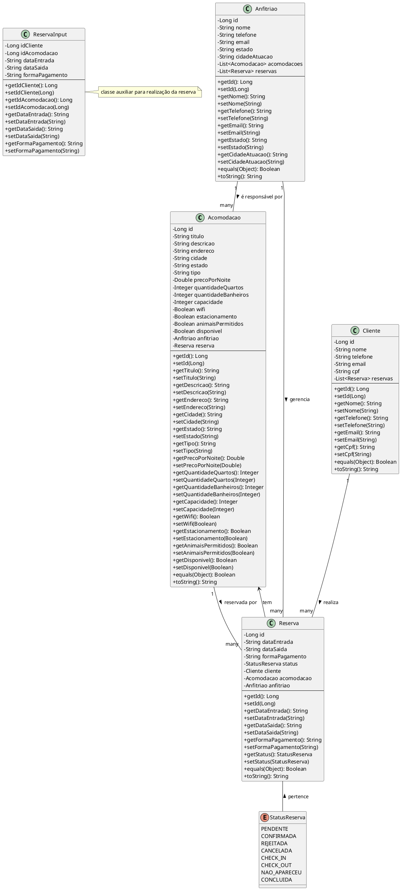

- Classe Acomodacao:

> Atributos: id, titulo, descricao, endereco, cidade, estado, tipo, precoPorNoite, quantidadeQuartos, quantidadeBanheiros, capacidade, wifi, estacionamento, animaisPermitidos, disponivel, anfitriao, reserva 
> Métodos: getId(), setId(), getTitulo(), setTitulo(), getDescricao(), setDescricao(), getEndereco(), setEndereco(), getCidade(), setCidade(), getEstado(), setEstado(), getTipo(), setTipo(), getPrecoPorNoite(), setPrecoPorNoite(), getQuantidadeQuartos(), setQuantidadeQuartos(), getQuantidadeBanheiros(), setQuantidadeBanheiros(), getCapacidade(), setCapacidade(), getWifi(), setWifi(), getEstacionamento(), setEstacionamento(), getAnimaisPermitidos(), setAnimaisPermitidos(), getDisponivel(), setDisponivel(), getAnfitriao(), setAnfitriao(), getReserva(), setReserva(), equals(), toString()

- Classe Anfitriao:
> Atributos: id, nome, email, estado, cidadeAtuacao, acomodacoes reservas 
> Métodos: getId(), setId(), getNome(), setNome(), getEstado(), setEstado(),getCidadeAtuacao(), setCidadeAtuacao(), getAcomodacoes(), getReservas(), equals(), toString()

- Classe Cliente:
> Atributos: id, nome, email, cpf, reservas 
> Métodos: getId(), setId(), getNome(), setNome(), getEmail(), setEmail(), getCpf(), setCpf(), getReservas(), equals(), toString()

- Classe Reserva:
> Atributos: id, dataEntrada, dataSaida, formaPagamento, status, cliente, acomodacao, anfitriao 
> Métodos: getId(), setId(), getDataEntrada(), setDataEntrada(), getDataSaida(), setDataSaida(), getFormaPagamento(), setFormaPagamento(), getStatus(), setStatus(), getCliente(), setCliente(), getAcomodacao(), setAcomodacao(), getAnfitriao(), setAnfitriao()

- ReservaInput:
> Atributos: idCliente, idAcomodacao, dataEntrada, dataSaida, formaPagamento 
> Métodos: getIdCliente(), setIdCliente(), getIdAcomodacao(), setIdAcomodacao(), getDataEntrada(), setDataEntrada(), getDataSaida(), setDataSaida(), getFormaPagamento(), setFormaPagamento()

## 🔹 Diagrama de Estados
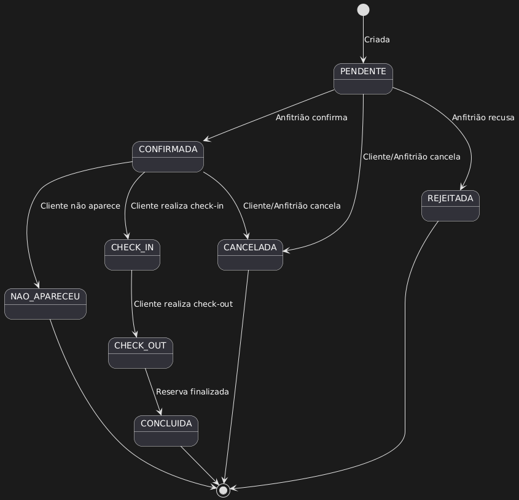

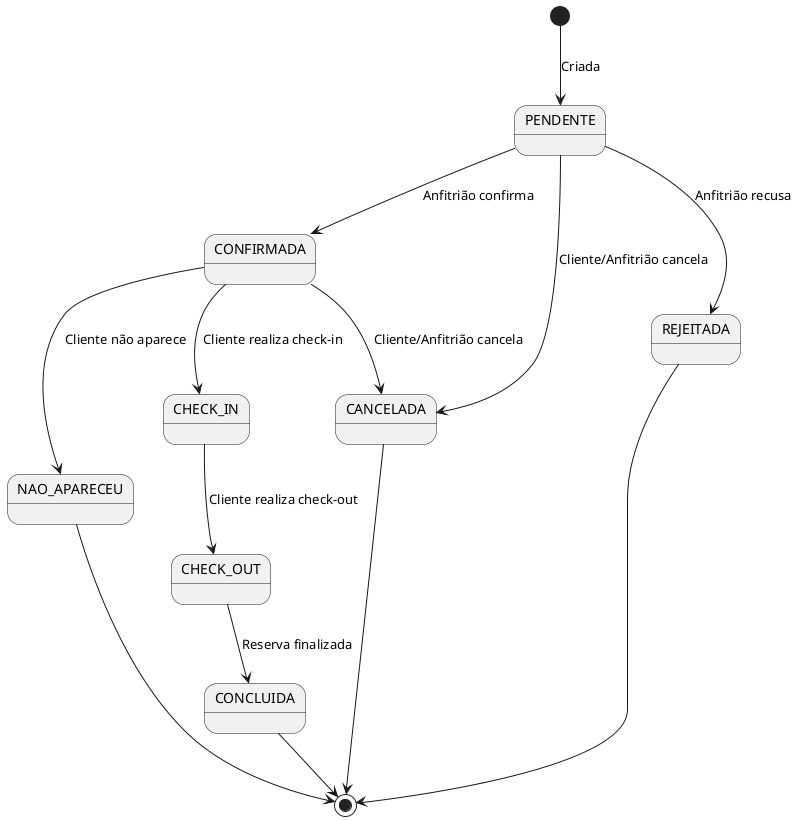
### Diagrama de Estados

O diagrama de estados descreve os estados pelos quais um objeto passa durante seu ciclo de vida.
Dentro Reserva, os estados podem ser:

Pendente: Reserva criada, aguardando confirmação. 
Confirmada: Reserva confirmada pelo anfitrião ou sistema. 
Rejeitada: Anfitrião recusou a reserva. 
Cancelada: Cliente ou anfitrião cancelou. 
Check-in: Cliente realizou o check-in. 
Check-out: Cliente finalizou a estadia. 
Não Apareceu: Cliente não compareceu. 
Concluída: Reserva finalizada com sucesso.